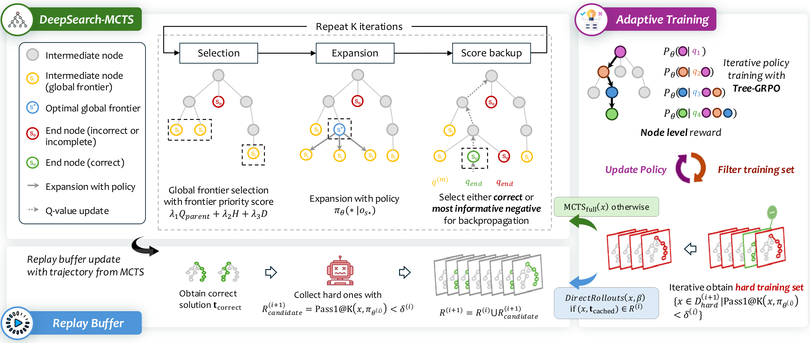

# DeepSearch: Overcome the Bottleneck of Reinforcement Learning with Verifiable Rewards via Monte Carlo Tree Search

<div align="center">

[](https://arxiv.org/abs/2509.25454)
[](https://huggingface.co/fangwu97/DeepSearch-1.5B)
[](LICENSE)

</div>

## 📖 Overview

**DeepSearch** is a novel reinforcement learning framework that addresses the fundamental challenge of balancing exploration breadth and depth in Monte Carlo Tree Search (MCTS). By introducing a **rollout-guided exploration mechanism** with **adaptive replay buffers**, DeepSearch achieves superior performance on mathematical reasoning tasks.

Built on VERL commit [`2bd291e5494db03ba358ef279a334c2f0829b979`](https://github.com/volcengine/verl/tree/2bd291e5494db03ba358ef279a334c2f0829b979)

---
<p align="center">
  
</p>


## 🔧 Environment Setup

### Prerequisites

DeepSearch requires the following dependencies:
- Python >= 3.10
- [`verl`](https://verl.readthedocs.io/en/latest/start/install.html) framework
- `sglang` for efficient inference

### Installation

1. **Install VERL framework**:
   ```bash
   cd DeepSearch
   # Follow the official VERL installation guide
   # https://verl.readthedocs.io/en/latest/start/install.html
   ```

2. **Install SGLang**:
   ```bash
   # Follow the official SGLang installation guide
   # https://docs.sglang.ai/get_started/install.html
   pip install sglang
   ```

3. **Install DeepSearch**:
   ```bash
   cd DeepSearch
   pip install -e .   # to active `import deepsearch`
   ```

---

## 🚀 Quick Start

### Inference with vLLM

Our pre-trained model [`fangwu97/DeepSearch-1.5B`](https://huggingface.co/fangwu97/DeepSearch-1.5B) supports efficient inference using vLLM.

**Install dependencies**:
```bash
pip install vllm>=0.8.5.post1
pip install transformers>=4.52.4
```

**Example usage**:
```python
from vllm import LLM, SamplingParams
from transformers import AutoTokenizer


def convert_question_to_messages(question: str):
    messages = [
        {"role": "user",
         "content": question + " Let's think step by step and output the final answer within \\boxed{}."}
    ]
    return messages


model_id = "fangwu97/DeepSearch-1.5B"
tokenizer = AutoTokenizer.from_pretrained(model_id)

sampling_params = SamplingParams(
    temperature=0.6,
    top_p=0.95,
    max_tokens=32768
)

model = LLM(
    model=model_id,
    tensor_parallel_size=1
)
prompt = tokenizer.apply_chat_template(
    convert_question_to_messages("Find the sum of all integer bases $b>9$ for which $17_{b}$ is a divisor of $97_{b}$."),
    add_generation_prompt=True,
    tokenize=False
)

outputs = model.generate({"prompt": prompt}, sampling_params=sampling_params, use_tqdm=False)
response = outputs[0].outputs[0].text
print(response)
```

---

## 🎓 Training

DeepSearch employs a multi-round training strategy with iterative data filtering and replay buffer accumulation to progressively improve model performance.

### Dataset

We provide the complete training data used in our experiments under the `data/` directory:

```
data/
├── deepmath103k_round0/
│   ├── train_0.parquet         # Problems with Pass1@4=0% on nvidia/Nemotron-Research-Reasoning-Qwen-1.5B
│   └── train_25.parquet        # Problems with Pass1@4=25% on nvidia/Nemotron-Research-Reasoning-Qwen-1.5B
├── deepmath103k_round1/
│   ├── train_0.parquet         # Problems with Pass1@4=0% on Round0 best checkpoint
│   └── train_25.parquet        # Problems with Pass1@4=25% on Round0 best checkpoint
└── val/
    └── aime2025_boxed_n32.parquet  # Validation set (placeholder, not actively used)
```

**Data source**: [`zwhe99/DeepMath-103K`](https://huggingface.co/datasets/zwhe99/DeepMath-103K)

The dataset is progressively filtered based on model performance across training rounds, focusing on challenging problems that the model has not yet mastered.

---

### Round 0: Initial Training

**Launch training:**
```bash
bash round0.sh
```

**Output structure:**
```
results/
└── deepsearch_1_5b_round0/
    ├── checkpoints/              # Model checkpoints saved every 5 steps
    │   ├── global_step_5/
    │   ├── global_step_10/
    │   └── ...
    └── rollout_data/             # MCTS rollout trajectories saved every step
        ├── 1.jsonl
        ├── 2.jsonl
        └── ...
```

**Convert checkpoints to HuggingFace format:**

Follow the [VERL checkpoint conversion guide](https://verl.readthedocs.io/en/latest/advance/checkpoint.html#convert-fsdp-and-megatron-checkpoints-to-huggingface-format-model) to merge FSDP/Megatron checkpoints into standard HuggingFace format.

---

### Replay Buffer Registration (Round 0)

**Register replay buffer from rollout data:**
```bash
python deepsearch/data_setup/register_replay_buffer.py \
    --rollout_dir results/deepsearch_1_5b_round0/rollout_data
```

**Output:**
```
results/
└── deepsearch_1_5b_round0/
    └── rollout_data/
        ├── 1.jsonl
        ├── 2.jsonl
        ├── ...
        └── replay_buffer_0.25.json  # Replay buffer with 25% success threshold
```

---

### Data Filtering for Round 1

We provide pre-filtered training data in `data/deepmath103k_round1/`. To create your own filtered dataset:

1. **Generate predictions** using the best Round 0 checkpoint:
   - Perform `n=4` generations per problem on `data/deepmath103k_round0`
   - Follow the vLLM inference example shown above

2. **Calculate Pass@4 scores**:
   - Use the evaluation metric from `deepsearch/data_setup/register_replay_buffer.py`

3. **Filter data** based on performance:
   - Keep problems with Pass1@4 = 0% (still challenging)
   - Keep problems with Pass1@4 = 25% (moderate difficulty)

---

### Round 1: Training with Replay Buffer

**Launch Round 1 training:**
```bash
bash round1.sh
```

This round incorporates:
- ✅ Filtered training data from Round 0 evaluation
- ✅ Accumulated replay buffer from Round 0
- ✅ Same rollout-guided MCTS exploration strategy

**Output structure:**
```
results/
└── deepsearch_1_5b_round1/
    ├── checkpoints/              # Round 1 checkpoints
    │   ├── global_step_5/
    │   └── ...
    └── rollout_data/             # Round 1 rollout data
        ├── 1.jsonl
        └── ...
```

---

### Extending to More Rounds

To continue training for additional rounds (Round 2, 3, ...):

1. **Register new replay buffer:**
   ```bash
   python deepsearch/data_setup/register_replay_buffer.py \
       --rollout_dir results/deepsearch_1_5b_round{N}/rollout_data
   ```
   ⚠️ **Important**: Combine the new replay buffer with previous ones to accumulate high-quality trajectories.

2. **Filter training data:**
   - Evaluate the current round's best model on the previous round's training data
   - Select problems with Pass1@4 = 0% or 25%
   - Update `data.train_files` in the training configuration

3. **Update training configuration:**
   - Set `data.train_files` to the newly filtered dataset path
   - Set `actor_rollout_ref.rollout.mcts_config.replay_buffer` to the accumulated replay buffer path

4. **Launch next round:**
   ```bash
   bash round{N}.sh
   ```

---

## 📊 Results

DeepSearch achieves competitive performance on challenging mathematical reasoning benchmarks. Please refer to our [paper](https://arxiv.org/abs/2509.25454) for detailed experimental results and analysis.

---

## 📝 Citation

If you find DeepSearch useful in your research, please consider citing:

```bibtex
@article{wu2025deepsearch,
  title={DeepSearch: Overcome the Bottleneck of Reinforcement Learning with Verifiable Rewards via Monte Carlo Tree Search},
  author={Wu, Fang and Xuan, Weihao and Qi, Heli and Lu, Ximing and Tu, Aaron and Li, Li Erran and ChoiRetry, Yejin},
  journal={arXiv preprint arXiv:2509.25454},
  year={2025}
}
```

---

## 🙏 Acknowledgments

- Built on the [VERL](https://github.com/volcengine/verl) reinforcement learning framework
- Training data sourced from [DeepMath-103K](https://huggingface.co/datasets/zwhe99/DeepMath-103K)
- Base model: [nvidia/Nemotron-Research-Reasoning-Qwen-1.5B](https://huggingface.co/nvidia/Nemotron-Research-Reasoning-Qwen-1.5B)

---

## 🤝 Contributing

We welcome contributions! Please feel free to submit issues or pull requests.

---

## 📧 Contact

For questions or feedback, please open an issue on GitHub.
